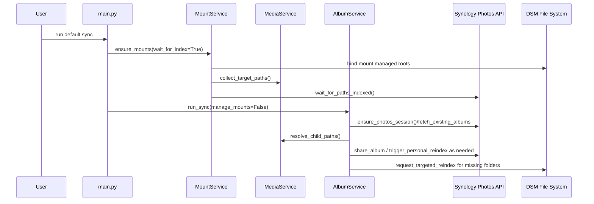
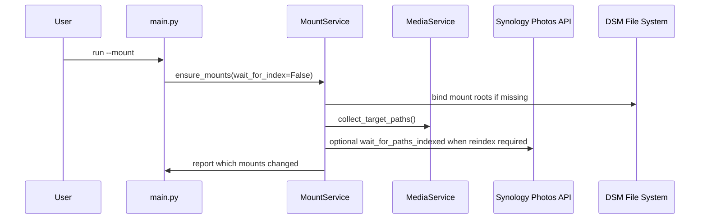
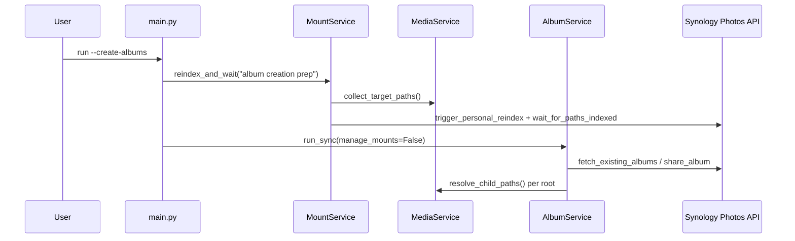
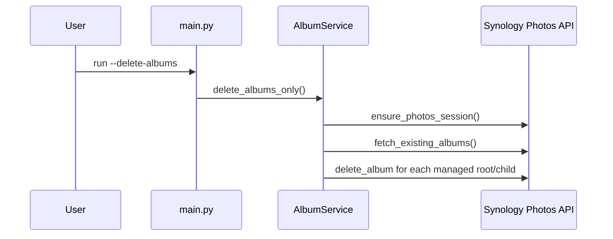
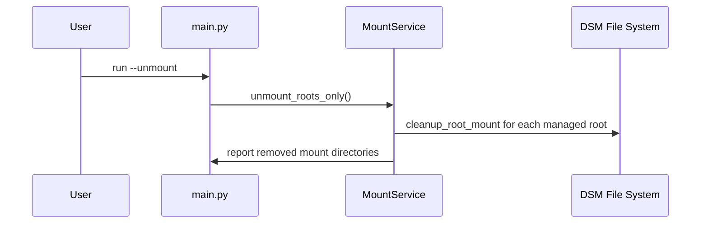
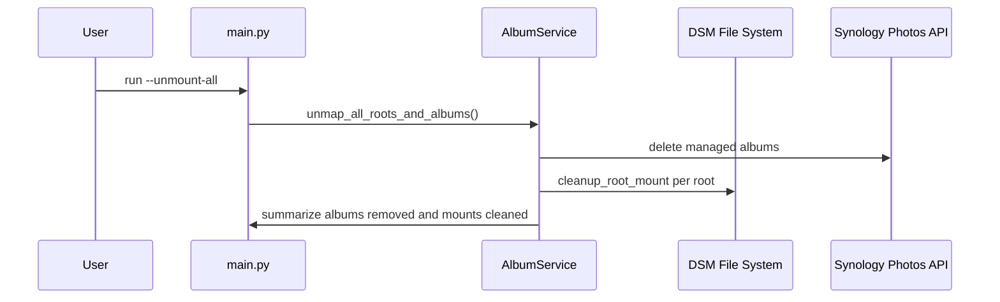

# Synology Albums Sync

Synology Albums Sync's `main.py` runs directly on your Synology NAS and keeps Team Space folders mirrored into personal-space condition albums so that invites, passphrases, and "Shared with others" stay aligned with the GUI.

## What the script does

1. **Bind-mount managed Team Space roots** – every folder listed in `sharing.managed_roots` (or auto-discovered from the Team Space) is mounted under the user’s personal Photos area (and detached again with `--unmount-all`/`--unmap`) so DSM indexes each child reliably.
2. **Create/refresh condition albums** – each direct child folder becomes a condition album named `<root> - <child>` bound to the exact `folder_filter` entry discovered for that path. The script caches the entire folder-filter table once per run (including a path index and parent→children map) so large trees are scanned quickly.
3. **Share folders with the configured targets** – we replay the same invite sequence the Synology Photos GUI emits because `SYNO.FotoTeam.Sharing.*` rejects condition albums with error 801. Invite targets remain in sync with the configured users/groups.
4. **Mirror personal Photos directories (optional)** – declare `sharing.personal_album_roots` entries to treat any subfolder inside your personal Photos space as a managed root. The tool walks those directories directly (no bind mounts) and creates the same `<label> - <child>` albums so family libraries or ad-hoc projects stay in sync even without Team Space access.

## Prerequisites

- Tested on DSM 7.2.1 running on a DS1621+; earlier DSM 7.x builds should behave similarly, but double-check Synology Photos API availability if you are on older firmware.
- Windows runs are album-only (bind mounts are disabled automatically); use a DSM/Linux host when you need mount management.

- Run the script on the NAS (or a Linux host that can issue `mount --bind` inside the Photos volume).
- `pip install -r requirements.txt` to grab `synology-api`, `python-dotenv`, `pyotp`, etc.
- DSM account requirements:
  - Access to Synology Photos Team Space content.
  - Write permissions to `/volume*/homes/<user>/Photos`.
  - (Optional) `SYNOLOGY_OTP_SECRET` if two-factor authentication is enabled.

## Quick start

1. Copy `.env_example` to `.env` and fill in your DSM credentials.
2. Copy `sync_config_example.json` to `sync_config.json`, then adjust paths/share targets for your environment.
3. Install dependencies:

	```
	pip install -r requirements.txt
	```

4. From the repo root, run whichever mode you need:

	```
	python main.py               # ensure bind mounts exist, wait for indexing, then create/refresh albums
	python main.py --mount       # only ensure bind mounts exist (boot-time helper)
	python main.py --create-albums  # refresh albums without touching mounts
	python main.py --create-personal-albums --share-with family_rw --max-depth 4 --path Family/Trips --label-prefix ""  # refresh only targeted personal folders with overrides
	python main.py --delete-albums  # delete only the managed condition albums
	python main.py --delete-personal-albums  # delete only personal-root albums
	python main.py --delete-personal-albums --path Family/Trips  # delete only the ad-hoc path’s albums
	python main.py --unmount     # detach bind mounts
	python main.py --unmount-all # delete albums and detach mounts (legacy alias: --unmap)
	```

Use `--share-with`, `--roles`, `--permission`, and `--max-depth` alongside `--create-personal-albums` to override sharing targets, roles, permissions, or scan depth just for that run (depth values <= 0 scan the full tree). Add `--path <relative/or/absolute>` when you want to manage a single folder without editing the JSON config (works with both create/delete flows), and `--label-prefix` if you want the albums for that ad-hoc path to use a custom prefix.

5. Schedule a DSM "Boot-up" task with `python main.py --mount` to re-create bind mounts after every restart, then a delayed task with `python main.py` (or `--create-albums`) once indexing catches up.

## Folder layout example (default sync)

The example below uses DSM user `photos_sync` and shows how bind mounts appear under the personal Photos space when running `python main.py` with no arguments.

**Before running `python main.py`:**

Team Space (`/volume1/photo`):

```
/volume1/photo
├─ team_family/
│  ├─ 2024/
│  └─ Shared/
└─ team_projects/
	└─ Archive/
```

Personal Photos (`/volume1/homes/photos_sync/Photos`):

```
/volume1/homes/photos_sync/Photos
└─ photos-shared/   # empty; mount targets will be created here
```

**After running `python main.py` (bind mounts + album refresh):**

Personal Photos (`/volume1/homes/photos_sync/Photos`):

```
/volume1/homes/photos_sync/Photos
└─ photos-shared/
	├─ mount_team_family/   -> /volume1/photo/team_family
	└─ mount_team_projects/ -> /volume1/photo/team_projects
```

Albums created in Synology Photos (examples):
- team_family - 2024
- team_family - Shared
- team_projects - Archive

Sharing applied in this example:
- `team_family` albums invite `family_rw`
- `team_projects` albums invite `project_group`

Mount folder names use `paths.root_mount_prefix`, and the parent directory comes from `paths.personal_shared_subdir` in `sync_config.json`.

## Personal space example (create personal albums)

This example shows a personal-only run (no bind mounts) using `photos_sync` with a `personal_album_roots` entry targeting `Family/Trips` and inviting both a user and a group.

`sync_config.json` snippet:

```
"personal_album_roots": [
	{
		"label": "Family Trips",
		"relative_path": "Family/Trips",
		"share_with": ["family_rw", "kids_group"],
		"share_roles": ["downloader"]
	}
]
```

**Before running `python main.py --create-personal-albums`:**

Personal Photos (`/volume1/homes/photos_sync/Photos`):

```
/volume1/homes/photos_sync/Photos
└─ Family/
	└─ Trips/
	   ├─ 2023/
	   └─ 2024/
```

Albums in Synology Photos:
- (none yet for these folders)

**Command:**

```
python main.py --create-personal-albums
```

**After running the command:**

Albums created in Synology Photos:
- Family Trips - 2023
- Family Trips - 2024

Sharing applied to each album:
- Invited user/group: `family_rw`, `kids_group`
- Role: `downloader`

Because personal roots live under the user’s Photos directory, no bind mounts are created; the scanner walks the configured path directly and creates albums for each child folder that already contains media.

## Project layout

```
synology-albums-sync/
├─ .env_example          # Secrets template (copy to .env)
├─ .env                  # Filled secrets (gitignored)
├─ main.py                 # CLI entrypoint (arg parsing + service wiring)
├─ README.md / TODO.md     # Docs and change log
├─ sync_config_example.json # Example config with placeholders
├─ sync_config.json        # Default configuration template
├─ requirements.txt        # Runtime dependencies (synology-api, dotenv, pyotp, ...)
├─ docs/
│  └─ api-usage.md         # How to embed Synology Albums Sync helpers in other projects
└─ synology_albums_sync/
	├─ __init__.py          # Package marker + exports
	├─ config.py            # Typed config loaders + runtime state helpers
	├─ services.py          # MountService + MediaService orchestration
	├─ albums.py            # AlbumService (CRUD/sharing/orphan pruning)
	├─ mounts.py / media.py # Low-level mount + media utilities
	├─ paths.py             # Filesystem normalization helpers
	├─ synology_api.py      # SynologyPhotosAPI + folder/index helpers
	└─ synology_web.py      # SynologyWebSharing (manual invite fallback)
```

Use the tree above as a quick reference when navigating the repo or when explaining Synology Albums Sync's moving pieces to other collaborators.

## CLI arguments

The CLI exposes a single mutually exclusive group of primary flags. Run `python main.py` without extra arguments to perform the default sync (mount if needed → wait for indexing → refresh managed albums). Use the following switches to target specific workflows:

| Flag | Behavior |
| --- | --- |
| *(none)* | Full sync: ensures mounts exist, triggers indexing when required, then calls `run_sync` to refresh Team Space albums and configured personal roots. |
| `--mount` | Ensure bind mounts exist (no album changes). Handy for DSM boot tasks. |
| `--create-albums` | Skip mount management but rebuild all Team Space albums (forces a reindex first). |
| `--delete-albums` | Remove every managed Team Space album while leaving folders intact. |
| `--unmount` | Detach bind mounts only. Legacy alias: `--unmound`. |
| `--unmount-all` | Delete all managed albums and unmount the roots in one pass. Legacy alias: `--unmap`. |
| `--create-personal-albums` | Refresh albums for `sharing.personal_album_roots` (or an ad-hoc path) without touching Team Space folders. |
| `--delete-personal-albums` | Remove albums created for `sharing.personal_album_roots` (optionally limited via `--path`; `--label-prefix` is ignored). |

### Personal overrides

The personal override flags fall into two buckets: sharing overrides (require `--create-personal-albums`) and path selectors (`--path`/`--label-prefix`, which work with either `--create-personal-albums` or `--delete-personal-albums`). Combine whichever overrides you need per run:

- `--share-with user1,user2` – Overrides the invite targets for every processed personal root during that run (create flows only).
- `--roles role1,role2` – Replaces the role list supplied to `SYNO.FotoTeam.Sharing` (e.g., `downloader`) when creating albums.
- `--permission view|download` – Forces the permission applied to each album share (create flows only).
- `--max-depth <n>` – Temporarily caps how deep the scanner walks a personal root during creation (`<= 0` = full depth).
- `--path <relative/or/absolute>` – Processes only the specified folder during create **or** delete runs. Relative paths resolve under `<homes>/<user>/Photos`; absolute paths must still reside within that personal Photos tree. The CLI rejects invalid or out-of-root paths before any work begins.
- `--label-prefix <text>` – When paired with `--path`, overrides the label/prefix used in album titles (e.g., `Holiday` yields `Holiday - Beach`). Pass an empty string (`--label-prefix ""`) if you want the albums to use only the child folder names. Works with both create and delete flows.

Example: `python main.py --create-personal-albums --share-with family_rw --max-depth 3 --path Family/Kids --label-prefix Kids Archive` refreshes only the `Family/Kids` tree, invites `family_rw`, limits the scan to a depth of three directories, and names albums `Kids Archive - <child>` for that run.

## Sequence Diagrams

The diagrams below summarize how each CLI flag drives the services, filesystem, and Synology APIs. Actors:

- **User** – human/operator triggering the CLI.
- **main.py** – CLI entrypoint that routes to services.
- **MountService / MediaService / AlbumService** – service layer abstractions.
- **DSM File System** – bind mounts and folder availability on disk.
- **Synology Photos API** – remote DSM APIs exposed via `synology_api`.

### Default sync (`python main.py`)



### Mount only (`python main.py --mount`)



### Album refresh only (`python main.py --create-albums`)



### Delete albums only (`python main.py --delete-albums`)



### Unmount only (`python main.py --unmount`)



### Unmap everything (`python main.py --unmount-all` / `--unmap`)



## Configuration

Non-secret behavior now lives in `sync_config.json`, while `.env` only keeps sensitive connection info (plus an optional pointer to the JSON file). The script automatically loads `SYNC_CONFIG_PATH` (default `sync_config.json`) and validates the required sections before starting.

### DSM permission checklist

Synology Photos follows the same ACLs as File Station/SMB. Set up the `photo` shared folder so every user only sees their Team Space roots:

1. **Create a sync user** – Pick a DSM account (for example `photos_sync`) that owns the personal Photos space. Grant this account access to the `photo` shared folder; it becomes `SYNOLOGY_USERNAME` in `.env`.
2. **Allow base access** – In **Control Panel → Shared Folder → photo → Edit**, keep the default “Enable access-based enumeration” on, but under **Permissions** make sure each user/group has at least `Read` access to `photo`. Without that, they cannot browse into their own root.
3. **Turn off advanced knobs** – In **Edit → Advanced**, disable shared-folder quotas and advanced share permissions for `photo`. The automation assumes standard ACLs only.
4. **Lock down each root** – For every Team Space root (e.g., `team_family`, `team_work`), open **File Station → photo → <root> → Properties → Permission**. Click **Advanced options → Disable inheritance**, then explicitly grant the intended user/group `Read/Write` (or `Read` if you prefer). With inheritance disabled, unlisted users already lose access, so you only need to add the accounts that should see that root. Repeat whenever you add a new root.
5. **Test as real users** – Sign in as the group members (or use DSM’s impersonate feature) and browse `photo`. They should only see their assigned roots. If a user still sees everything, re-check the inheritance toggle for that root.
6. **Revisit after DSM updates** – Major DSM upgrades occasionally re-enable inheritance. Keep an eye on permissions if folders suddenly become visible to the wrong audience.

### Photos Shared Space configuration

- **Custom access per root** – In Photos → Settings → Shared Space → Permissions, set **Custom** access for each user/group on every managed root (e.g., `team_family`, `team_projects`). Grant only the roots they should see; remove access for unrelated roots.
- **Subfolder scoping** – For roots with mixed visibility, open the folder’s permissions panel and set custom access for subfolders that should remain hidden or read-only. This mirrors the DSM/File Station ACLs so album creation matches what users can browse or upload.
- **Upload vs. view** – Give `Read/Write` to users who should upload new folders; use `Read` for view-only users. The sync will then surface new folders as albums when a periodic task runs.
- **Periodic sync** – Schedule a recurring task (e.g., daily or hourly) running `python main.py --create-albums` (or `--create-personal-albums`) so newly added folders become albums after DSM indexing completes.

After this checklist, browsing `\\<nas>\photo` or File Station mirrors the same access the automation enforces through Synology Photos sharing.

### Secrets in `.env`

| Variable | Description |
| --- | --- |
| `SYNOLOGY_IP`, `SYNOLOGY_PORT` | DSM host/port (defaults 5000/5001 when omitted).
| `SYNOLOGY_USERNAME`, `SYNOLOGY_PASSWORD` | DSM account that owns the personal Photos space.
| `SYNOLOGY_OTP_SECRET` | Optional TOTP seed when DSM has 2FA enabled.
| `SYNC_CONFIG_PATH` | Optional override for the JSON config location (defaults to `sync_config.json`).

### `sync_config.json` layout

The JSON file is split into logical sections; each tone-only knob moved here from `.env` now lands in one of these blocks.

```
{
	"synology": { ... },
	"paths": { ... },
	"mounts": { ... },
	"indexing": { ... },
	"sharing": { ... }
}
```

#### `synology`

| Field | Description |
| --- | --- |
| `dsm_version` | Override the DSM major version reported to the API (defaults to 7).

#### `paths`

| Field | Default | Purpose |
| --- | --- | --- |
| `personal_homes_root` | `/volume1/homes` | Base homes directory (Photos root becomes `<homes>/<user>/Photos`).
| `personal_shared_subdir` | `photos-shared` | Subdirectory inside the personal Photos tree that stores bind mounts.
| `shared_photo_root` | `/volume1/photo` | Physical Team Space root.
| `root_mount_prefix` | `mount_` | Prefix applied to auto-created mount directories.

#### `mounts`

| Field | Default | Purpose |
| --- | --- | --- |
| `enable_root_bind_mounts` | `true` | Toggle bind-mount creation (auto-disabled on Windows or when `mount`/`umount` are missing).

#### `media`

| Field | Default | Purpose |
| --- | --- | --- |
| `scan_max_depth` | *(full depth)* | Limits how deep the scanner walks each root. Omit or set `<= 0` to scan the entire tree; higher values bound how far nested folders are inspected before waiting on DSM indexing.

#### `indexing`

| Field | Default | Purpose |
| --- | --- | --- |
| `reindex_settle_seconds` | `10` | Delay between reindex requests and folder-filter refresh.
| `filter_wait_attempts` / `filter_wait_delay` | `12` / `5` | Polling behavior while waiting for DSM to expose a managed path.
| `force_reindex_on_start` | `false` | Trigger a reindex before processing roots.
| `reindex_after_link` | `true` | Reindex immediately after a link/mount change.
| `personal_reindex_command` | *(auto-detected)* | Custom CLI fallback when Synology’s API reindex call fails.

#### `sharing`

| Field | Default | Purpose |
| --- | --- | --- |
| `managed_roots` | *(discovered)* | Explicit list of Team Space roots to manage; leave empty to auto-discover under `paths.shared_photo_root` (mount-prefixed folders are skipped automatically).
| `root_share_with` | `{}` | Map of root → invite targets (mirrors the previous `ROOT_SHARE_WITH_JSON`).
| `default_share_with` | `[]` | Fallback invite targets when a root lacks an explicit mapping.
| `default_share_permission` | `view` | Permission applied to each shared folder (`view`, `download`; accepts `viewer`/`downloader` aliases).
| `default_share_roles` | `[]` | Optional role list for `SYNO.FotoTeam.Sharing` (e.g., `"downloader"`).
| `enable_public_sharing` | `true` | Allow fallback to `SYNO.Foto.PublicSharing` when per-user invites fail.
| `share_link_url_base` | *(empty)* | Optional base URL used when printing "shared link" summaries.
| `personal_album_roots` | `[]` | Optional list of personal Photos directories to mirror without bind mounts (see below).

The sharing section also auto-builds `target_roots` by combining `managed_roots` (or discovered directories) with per-root invite settings. Expect informative console output when no folders are found so you can adjust the config quickly.

`personal_album_roots` accepts objects with the following fields:

- `path` or `relative_path` – Absolute path under the user’s Photos directory, or a path relative to `<homes>/<user>/Photos`.
- `label` – Friendly name used in console logs and album titles. Defaults to the relative path with `/` replaced by ` - `.
- `share_with`, `permission`, `share_roles` – Optional overrides that mirror the main sharing defaults.

Example entries:

```
"personal_album_roots": [
	{
		"label": "Family Archive",
		"path": "/volume1/homes/photos_sync/Photos/family",
		"share_with": ["family_rw"],
		"permission": "download"
	},
	{
		"label": "Kids Projects",
		"relative_path": "Projects/Kids",
		"share_with": ["kids_group"],
		"permission": "view"
	}
]
```

During a sync run, each configured personal root is scanned directly on disk (no bind mounts) and every child folder that already contains media becomes an album named `<label> - <child>`, following the same pruning/sharing rules as Team Space roots.
Pair `--create-personal-albums` with the sharing overrides (`--share-with`, `--roles`, `--permission`, `--max-depth`) when you need to tweak invite targets, roles, permissions, or depth without editing `sync_config.json`. Use `--path` (optionally `--label-prefix`) with either `--create-personal-albums` or `--delete-personal-albums` for ad-hoc runs that only touch a single folder (creation or cleanup) while leaving the JSON config unchanged.

### Example configuration files

Copy `.env_example` to `.env` and fill in your own host/user/password values. The snippets below mirror the template file.

There is also a `sync_config_example.json` in the repo with placeholder paths, roots, and sharing targets that match the examples used above; copy it to `sync_config.json` and adjust for your environment.

When adapting `sync_config_example.json`:
- Set `paths.personal_homes_root` to your homes volume (e.g., `/volume1/homes`) and keep `personal_shared_subdir` / `root_mount_prefix` unless you already use different names.
- List your Team Space roots in `sharing.managed_roots`, and map each to real users/groups in `root_share_with` (e.g., `family_rw`, `project_group`).
- Update `personal_album_roots` with your personal folders, adjusting `path`/`relative_path`, `label`, and `share_with` targets (e.g., `family_rw`, `kids_group`).
- Leave `scan_max_depth`, `indexing`, and `enable_public_sharing` as-is unless you need different limits or sharing behavior.

`.env` (secrets only):

```
SYNOLOGY_IP=192.0.2.25
SYNOLOGY_PORT=5000
SYNOLOGY_USERNAME=photos_sync
SYNOLOGY_PASSWORD=change_me
SYNC_CONFIG_PATH=/volume1/homes/photos_sync/sync_config.json
```

`sync_config.json`:

```
{
	"paths": {
		"personal_homes_root": "/volume2/homes",
		"personal_shared_subdir": "",
		"shared_photo_root": "/volume2/photo",
		"root_mount_prefix": "mount_"
	},
	"mounts": {
		"enable_root_bind_mounts": true
	},
	"media": {
			"scan_max_depth": 5
	},
	"indexing": {
		"reindex_settle_seconds": 30,
		"filter_wait_attempts": 60,
		"filter_wait_delay": 10
	},
	"sharing": {
		"managed_roots": ["team_shared", "team_family", "team_projects"],
		"root_share_with": {
			"team_shared": ["family_rw"],
			"team_family": ["family_rw"],
			"team_projects": ["project_group"]
		},
		"default_share_permission": "download",
		"default_share_roles": ["downloader"]
	}
}
```

## Execution flow

1. **Login and cache folder filters.** We authenticate once, capture the entire `folder_filter` table (plus its parent→children map), and reuse it for every root.
2. **Mount each managed Team Space root.** When `ENABLE_ROOT_BIND_MOUNTS=true`, every root is bind-mounted (or re-used if already in place). Schedule `python main.py --mount` as a DSM boot task to reapply mounts after reboot. When the flag is `false`, make sure those folders already exist under the personal Photos tree before running the script.
3. **Wait for indexing.** The script polls `folder_filter` for each mount target, optionally triggering `SYNO.Foto.Index` (or your custom CLI command) until the personal path exists.
4. **Create/update condition albums.** For every direct child folder, we generate a `<root> - <child>` album tied to its folder-filter entry and apply the configured sharing policy (using the per-root entries in `sharing.root_share_with`, falling back to the defaults).
5. **Prune orphans.** Any managed album whose folder ID disappears from the cached tree is deleted to keep the personal space tidy.

Because the folder-filter cache is reloaded only when needed, even large trees complete quickly and Synology’s APIs are called sparingly.

## Service layer

The orchestration code is split between [synology_albums_sync/services.py](synology_albums_sync/services.py) (mount/media plumbing) and [synology_albums_sync/albums.py](synology_albums_sync/albums.py) (album orchestration) so `main.py` only wires CLI flags to higher-level responsibilities:

- **`MountService`** enforces bind mounts and optionally triggers reindex cycles before album work begins.
- **`MediaService`** wraps media discovery helpers so both mounts and albums share a single source of truth for target paths.
- **`AlbumService`** (implemented in [synology_albums_sync/albums.py](synology_albums_sync/albums.py)) owns album CRUD, sharing, orphan pruning, and the `--unmount-all` cleanup workflow via a cached view of Synology’s folder filters.
- Lower-level helpers in [synology_albums_sync/synology_api.py](synology_albums_sync/synology_api.py) and [synology_albums_sync/paths.py](synology_albums_sync/paths.py) now read from `APP_CONFIG`/`RUNTIME_STATE`, so every API call and filesystem operation reflects the JSON-configured environment.

If you need to extend behavior (custom mount heuristics, alternative sharing rules, etc.) add a new service or compose the existing ones rather than growing `main.py`.

### Reusable Synology helpers

[synology_albums_sync/synology_api.py](synology_albums_sync/synology_api.py) now exposes a `SynologyPhotosAPI` class that can be instantiated with any config/state bundle (plus an optional `SynologyWebSharing` helper). The module still exports convenience functions backed by a default instance, but other projects can import the class, inject their own config, and call methods such as `ensure_photos_session()`, `wait_for_paths_indexed()`, or `share_album()` without pulling in this entire CLI. Likewise, [synology_albums_sync/synology_web.py](synology_albums_sync/synology_web.py) publishes a `SynologyWebSharing` helper plus default wrappers so manual-share fallbacks stay DI-friendly.

## Library integration

Synology Albums Sync intentionally keeps the Synology API/Web helpers framework-agnostic, so you can reuse them in custom automations, FastAPI workers, or even notebook experiments. You can import `SynologyPhotosAPI` and `SynologyWebSharing` directly from the top-level package, along with `load_app_config()` and `build_runtime_state()` when you want a standalone config/state per process. See [docs/api-usage.md](docs/api-usage.md) for:

- Instantiating `SynologyPhotosAPI`/`SynologyWebSharing` with your own config + runtime state
- Ensuring sessions, waiting for folder filters, and sharing albums without the CLI
- Tips for mixing these helpers with other schedulers or orchestration layers

## Refactor roadmap

1. **Step 1 – Document the plan (complete).** This README plus TODO now spell out the service boundaries, configuration surface area, and CLI flows so future refactors start from an accurate source of truth.
2. **Step 2 – Remove compatibility exports (complete).** All legacy `settings.*` shims were deleted after migrating call sites to `APP_CONFIG`/`RUNTIME_STATE`, so only the typed configuration/state remain.
3. **Step 3 – Finalize the config move (pending).** Audit `.env` for any non-secret toggles, replicate them inside `sync_config.json`, and update the docs so secrets-only `.env` usage becomes the enforced default.

## Scheduling & CLI tips

- `python main.py --create-personal-albums --share-with <users>` when you only need to refresh the personal roots (paired with optional overrides), and `python main.py --delete-personal-albums` to clean them up without touching Team Space folders.

### DSM Task Scheduler recipe

1. Open **Control Panel → Task Scheduler** and click **Create → Triggered Task → User-defined script**.
2. Name it `Synology Albums Sync mounts`, set **User** to `root`, and pick **Event → Boot-up**.
3. In the **Task Settings** tab, paste the command `cd /volume1/homes/<user>/synology-albums-sync && /usr/local/bin/python3 main.py --mount` (adjust paths/interpreter as needed).
4. (Optional) Enable **Send run details by email** or log to a file for troubleshooting.
5. Create a second task scheduled for a delayed time (e.g., “Daily” + 5 minutes after boot) that runs `python main.py` or `python main.py --create-albums` so album + sharing updates happen after indexing catches up.

## Support

If this project helps you, consider sponsoring: https://github.com/sponsors/AicubTm

[](https://github.com/sponsors/AicubTM)

## Troubleshooting

- If new folders take a long time to appear, bump `REINDEX_SETTLE_SECONDS` or the `FILTER_WAIT_*` values.
- Supply `PERSONAL_REINDEX_COMMAND` (for example `synophoto_dsm_userindex --user photos_sync --rebuild`) if Synology’s API intermittently fails.

## Known limitations & lessons learned

- Bind mounts require running on DSM/Linux with root privileges. On Windows (or when `mount`/`umount` are missing) the script automatically disables `ENABLE_ROOT_BIND_MOUNTS`, so only album/sharing refreshes run.
- Pure symlink workflows were unreliable: Synology Photos skipped indexing symlink targets, so we now rely exclusively on bind mounts. If you still have symlinks under `PERSONAL_SHARED_SUBDIR`, run `python main.py --unmount-all` to replace them before managing albums.
- Custom `PERSONAL_SHARED_SUBDIR` or `PERSONAL_HOMES_ROOT` values must already exist and be indexed. We’ve seen albums fail to appear when DSM hadn’t discovered the new path, so always create the directory and trigger a reindex after changing these settings.
- Synology’s `SYNO.FotoTeam.Sharing.*` API still rejects condition albums (error 801). The script mimics the Photos GUI flow and falls back to `SYNO.Foto.PublicSharing` when per-user invites are unsupported, meaning you may only get a public link in those cases.
